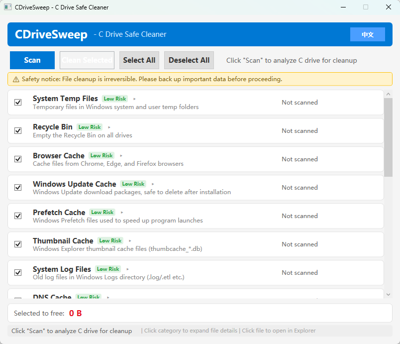
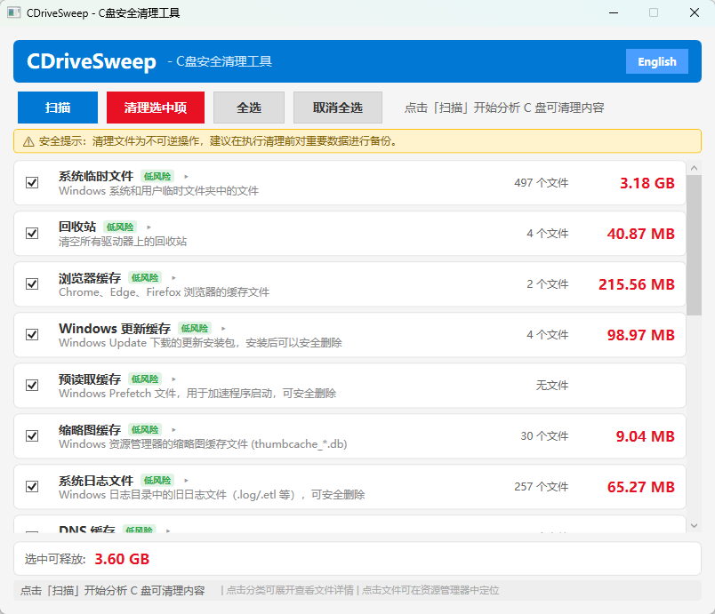

# CDriveSweep - C盘安全清理工具

[](LICENSE)
[]()
[]()

一个安全的 Windows C 盘清理工具，支持 **18 个清理分类**，提供 GUI 图形界面和 CLI 命令行两种使用方式，内置中英文双语切换。

[English](#english) | **中文**

---

## ✨ 功能特点

- **18 个清理分类** — 临时文件、浏览器缓存、聊天应用、大文件、重复文件等
- **安全优先** — 先扫描后清理，风险等级标注，需用户确认
- **GUI + CLI 双模式** — WPF 桌面端 + 命令行工具
- **中英双语** — 按钮一键切换，实时生效
- **Junction 感知** — 自动跳过 `mklink /J` 文件夹链接，避免重复计算
- **权限提示** — 需要管理员权限时自动提示

## 📸 截图





## 🔧 清理分类

| 分类 | 风险 | 说明 |
|------|------|------|
| 系统临时文件 | 低 | `%TEMP%` 和 `C:\Windows\Temp` |
| 回收站 | 低 | 清空所有驱动器的回收站 |
| 浏览器缓存 | 低 | Chrome / Edge / Firefox 缓存 |
| Windows 更新缓存 | 低 | `SoftwareDistribution\Download` |
| 预读取缓存 | 低 | `C:\Windows\Prefetch` |
| 缩略图缓存 | 低 | `thumbcache_*.db` 文件 |
| 系统日志文件 | 低 | Windows\Logs 下的 `.log` / `.etl` |
| DNS 缓存 | 低 | `ipconfig /flushdns` |
| 内存转储文件 | 低 | `C:\Windows\MEMORY.DMP` |
| 传递优化缓存 | 低 | Windows 更新分发缓存 |
| 错误报告文件 | 低 | WER 崩溃转储 |
| 旧版 Windows 备份 | 低 | `C:\Windows.old` |
| 微信/企业微信缓存 | **中** | 聊天图片、视频、文件缓存 |
| QQ 缓存 | **中** | 群聊图片/视频缓存 |
| NuGet 包缓存 | **中** | 旧版 NuGet 包 |
| 大文件扫描 | 需确认 | C 盘下 >100MB 的文件 |
| 重复文件查找 | 需确认 | MD5 相同的文件 |
| 空文件夹 | 需确认 | C 盘下的空目录 |

## 🚀 快速开始

### 直接下载（推荐）

前往 [Releases](https://github.com/jiuzhouhai/CDriveSweep/releases) 下载 `CDriveSweep.exe`。

### 从源码构建

```bash
git clone https://github.com/jiuzhouhai/CDriveSweep.git
cd CDriveSweep
dotnet build
```

**启动 GUI：**
```bash
dotnet run --project src/CDriveSweep.App
```

**启动 CLI：**
```bash
dotnet run --project src/CDriveSweep.Cli -- --scan
dotnet run --project src/CDriveSweep.Cli -- --clean -y
dotnet run --project src/CDriveSweep.Cli -- --lang en --scan
```

### 发布为单文件 EXE

```bash
dotnet publish src/CDriveSweep.App -c Release -r win-x64 --self-contained true -p:PublishSingleFile=true -o publish
```

## 📂 项目结构

```
CDriveSweep/
├── src/
│   ├── CDriveSweep.Core/       # 核心引擎 + 18 个清理器
│   │   ├── Cleaners/           # ICleaner 实现
│   │   ├── Localization/       # 中英文资源文件
│   │   └── Models/             # ScanItem、ScanResult、CleanResult
│   ├── CDriveSweep.App/        # WPF 图形界面
│   │   ├── ViewModels/         # MVVM 绑定模型
│   │   └── Converters/         # XAML 值转换器
│   └── CDriveSweep.Cli/        # 命令行工具
├── LICENSE
└── README.md
```

## ⚠️ 免责声明

本工具会删除系统文件。尽管我们只清理安全的非必要文件，**请在清理前备份重要数据**。作者不对数据丢失承担任何责任。

---

<a id="english"></a>

## CDriveSweep - C Drive Cleanup Tool

A safe Windows C drive cleanup tool with **18 cleanup categories**, supporting both GUI and CLI modes with built-in Chinese/English bilingual switching.

### Features

- **18 cleanup categories** — system temp, browser cache, chat apps, large files, duplicates, and more
- **Safe first, clean later** — scan before clean, risk level labels, manual confirmation required
- **GUI + CLI** — WPF desktop app for general users, command-line tool for power users
- **Bilingual** — Chinese and English, switchable in real-time at the click of a button
- **Junction-aware** — automatically skips `mklink /J` reparse points to avoid double-counting
- **Admin-aware** — prompts to run as administrator when permission is required

### Quick Start

Download `CDriveSweep.exe` from [Releases](https://github.com/jiuzhouhai/CDriveSweep/releases), or build from source:

```bash
git clone https://github.com/jiuzhouhai/CDriveSweep.git
cd CDriveSweep
dotnet run --project src/CDriveSweep.App
```

### Disclaimer

This tool deletes files from your system. While we strive to only clean safe, non-essential files, **please back up important data before use**. The author assumes no responsibility for data loss.

## 📄 License

MIT © [jiuzhouhai](https://github.com/jiuzhouhai)
